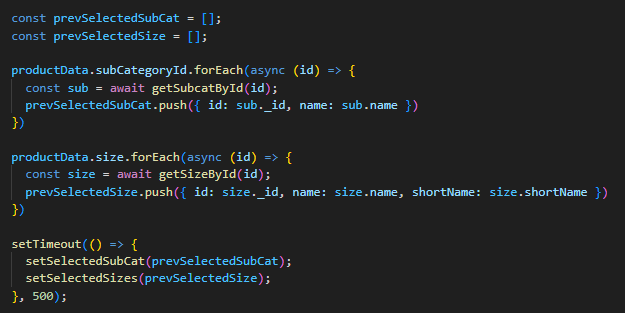
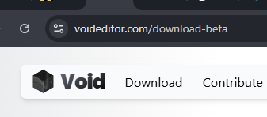

## 21/05/2025

> **Why setTimeout used ?**



`getSubCatById` and `getBySizeId` this two api called in each iteration of their `forEach` loop.

So, it takes time to complete each `forEach` Loop.
Thus, used setTimeout.

_Othervise_, it sets initial value of `prev` variable which is empty array.

> **code suggetor IDE `IntelliJ`, `jetBrain`**

- vs extension
  

- Free for javascript and typescript (for profetional usage it may charge)
  

- another is Void
  

---

<br>
<br>

## 28/05/2025

> Why setTimeout used in below code ?

```javascript
const popupContainer = useRef(null);

useEffect(() => {
  function handleClickOutside(event) {
    // console.log('Event listener triggered..');
    // console.log('event.target', event.target);
    // console.log('popupContainer.current', popupContainer.current);
    // console.log('popupContainer.current.contains(event.target)', popupContainer.current.contains(event.target));
    if (
      popupContainer.current &&
      !popupContainer.current.contains(event.target)
    ) {
      setIsSubCatListOpen(false);
    }
  }

  if (isSubCatListOpen) {
    setTimeout(
      () => document.addEventListener("click", handleClickOutside),
      [300]
    );
  }

  return () => {
    document.removeEventListener("click", handleClickOutside);
  };
}, [isSubCatListOpen]);
```

<br>

## Close popup by clicking it on outside and don't close when click on popup itself

- A button to open a popup dialog
- A popup that closes if you click outside of it
- Clicking inside the popup does nothing

```js
import React, { useRef, useState, useEffect } from "react";

function App() {
  const [isOpen, setIsOpen] = useState(false);
  const popupRef = useRef(null);

  // Close popup if clicked outside
  useEffect(() => {
    function handleClickOutside(event) {
      if (popupRef.current && !popupRef.current.contains(event.target)) {
        setIsOpen(false);
      }
    }

    if (isOpen) {
      document.addEventListener("mousedown", handleClickOutside);
    }

    return () => {
      document.removeEventListener("mousedown", handleClickOutside);
    };
  }, [isOpen]);

  return (
    <div style={{ padding: "50px" }}>
      <button onClick={() => setIsOpen(true)}>Open Popup</button>

      {isOpen && (
        <div
          ref={popupRef}
          style={{
            marginTop: "20px",
            padding: "20px",
            background: "#fff",
            border: "1px solid #ccc",
            boxShadow: "0 4px 8px rgba(0,0,0,0.1)",
            width: "200px",
          }}
        >
          <p>This is a popup!</p>
        </div>
      )}
    </div>
  );
}

export default App;
```

### 🔍 When does below code run?

```js
return () => {
  document.removeEventListener("mousedown", handleClickOutside);
};
```

React runs the **cleanup** function in these situations:

- **when useEffect's dependancies changges, useEffect's inner function runs,**
- **Before this useEffect's inner function runs, it first runs return function with previous value of dependancies**
- When the component unmounts

<br>

### What below condisition says

```js
if (popupRef.current && !popupRef.current.contains(event.target))
```

1. **`popupRef.current`**

   - This checks whether the popup DOM element currently **exists** (i.e. the popup is open).

   - If it’s null, the popup isn't on the screen.

2. **`if(!popupRef.current.contains(event.target))`**

   - **event.target :** It is html element which is clicked by user.

   ```jsx
   // popupRef.current element
   <div
     ref={popupRef}
     style={{
       marginTop: "20px",
       padding: "20px",
       background: "#fff",
       border: "1px solid #ccc",
       boxShadow: "0 4px 8px rgba(0,0,0,0.1)",
       width: "200px",
     }}
   >
     <p>This is a popup!</p>
   </div>
   ```

   - This checks if the click happened outside the popup.

   - event.target is the element that was clicked.

   - .contains() returns true if the clicked element is inside the popup — so !contains(...) means it's outside.

## # Incorrect : assignment of varible inside JSX Return
```js
arr.map((val, idx) => (
  <div>
    {(temp = val)} // Should not use assignment inside JSX
    {console.log("temp", temp)}
    ...some code
  </div>
));
```

**Corrected Code :**

```js
arr.map((val, idx) => {
  const temp = val;
  console.log("temp", temp);

  return <div>...some code</div>;
});
```


## # Incorrect : copy array state into a varible
```js
  const [stateArr, setStateArr] = useState([{ size: '', stock: '' }]);

// in some function
function someFunc(){
  const tempArr = stateArr;  
}
```

- Above is incorrect `tempArr = stateArr`
- we cannot assing state array direct to variable
- `tempArr` is now reffernce of `stateArr`
- ...